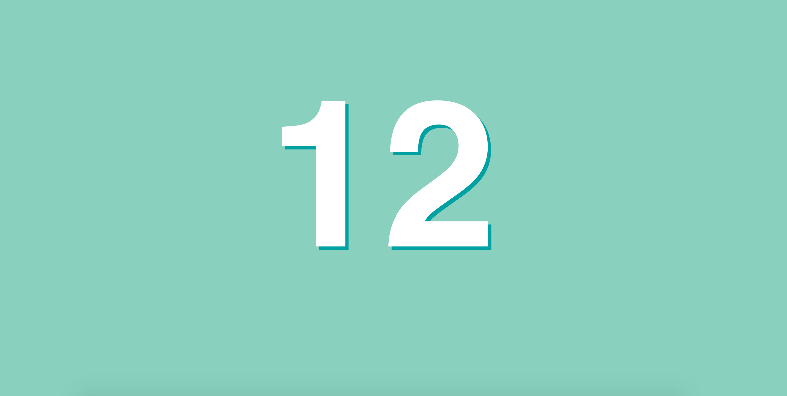

This program listens to knocks (like a ping pong ball on a table) and sends signals to a mini web server hosted on the board through a websocket.

Watch the [demo video here](https://www.youtube.com/watch?v=ul1E68GvWqg).  

Websockets are really useful to get live updates without refreshing the page.  
On the front-end I used 10 lines of AJAX/Javascript stored in ``play.h`` to listen to the websocket and display this kind of page
  at the url

You can open the webpage by going to this address : ``http://IP.ADRESS.OF.THE.ESP8266:80`` with a desktop or a smartphone on the same wifi as the one you need to configure in the ``.ino`` file.

``knockio.ino`` is the programm intented to be loaded in a WEMOS MINI D1 or a compatible ESP8266 board.  
For info you can add a program to this type of card with the Arduino IDE.  
I used [this awesome library for websockets ](https://github.com/Links2004/arduinoWebSockets).

## Questions/problems/improvements ?
Please open a github issue :)
Thanks !
